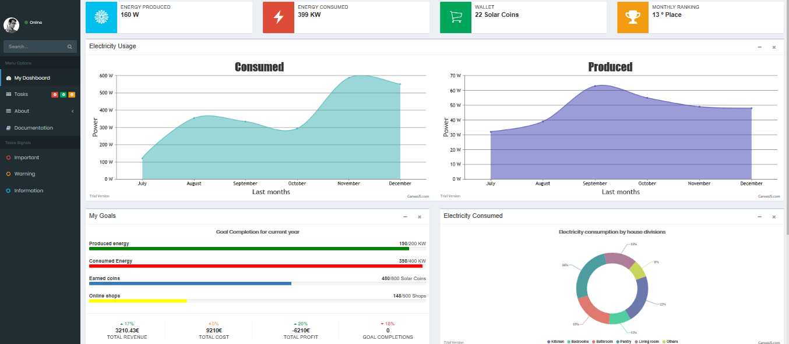

<h1> Energy Mover </h1>

 Modern demand-side management techniques are an integral part of the envisioned smart grid paradigm. They require an active involvement of the consumer for an optimization of the grid's efficiency and a better utilization of energy sources. This applies especially in so called demand dispatch systems, where consumers are required to proactively communicate their flexibilities. However, a monetary compensation may not sufficiently motivate the individual consumer for a sustainable participation in such a program. The proposed approach uses a motivational framework leveraging the novel area of gamification, which applies well-known game mechanics, such as points and leaderboards, to engage customers in the system. This is accomplished by embedding a special scoring system and social competition aspects into a stimulating user interface for the definition and management of flexible energy demand. In a first user study, the system showed a high user acceptance and the potential to engage consumers in participation.

 Starting with the web application's initial interface, the user will be able to register on the platform with the google account to make the process more secure and convenient.

<h1 align="center">
    
</h1>

 The informative character of the application means that consumers have at their disposal a set of information about their energy consumption in a detailed and organized way. The information provided gives the user full control over electricity consumption and production.

 In addition to the current energy consumption and production the application undertakes to present their evolution at the user's residence in the last six months. Last but not least, the application offers the user certain annual goals to give extra motivation to save electricity in his home as well as monthly rankings to reward residents with better results related to that evolution.

<h1 align="center">
    
</h1>

 
<h4 align="center">
    Made with ❤ by pedromiguelcp. Project no longer under development. 🏁
</h4>
